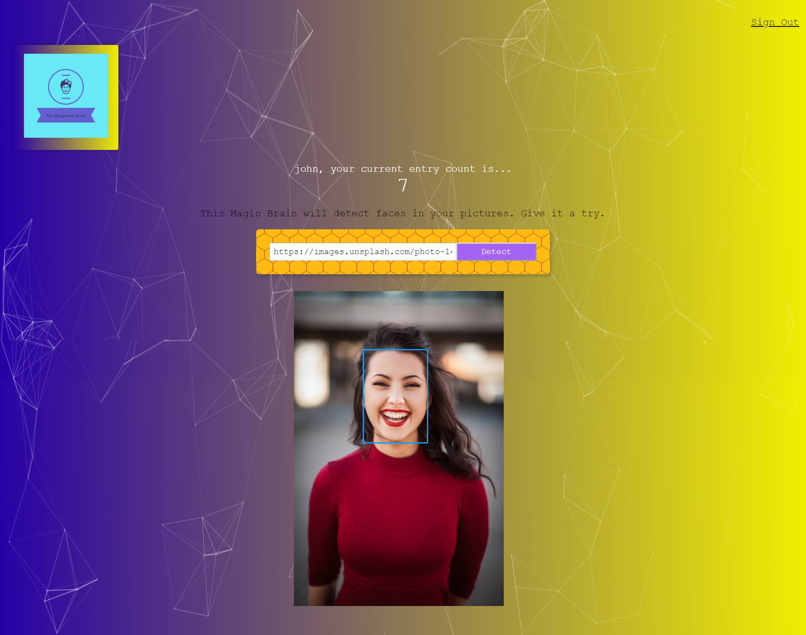

# Smart Brain
- [Live Demo](https://smart-brain-facefinder.herokuapp.com/)

Smart Brain is a web app that uses the Clarifai API to locate a face in a picture.

This API built with Node.js, Express.js, as well as a PosrtgreSQL is in charge of user signin/registration as well as keeping track of the number of entries for each user.

## Technologies Used

### NPM Packages
- Bcrypt
- PostgreSQL
- knex
- body parser
- cors
- express
